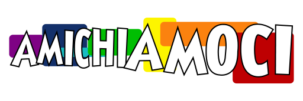

# Amichiamoci App
[](https://github.com/Amichiamoci/App/actions/workflows/docker-build.yml)

[](https://github.com/Amichiamoci/App/actions/workflows/ftp-deploy.yml)

Questo è il codice sorgente della App di Amichiamoci, disponibile come repository ed anche come immagine docker.

## Scaricare con Docker
```bash
docker pull gchr.io/amichiamoci/app:latest
```

### Testa localmente con Docker
Clona la repo
```bash
git clone https://github.com/Amichiamoci/App && cd App
```

Esegui
```bash
docker build . --tag 'amichiamoci-app'
```
E dopo
```bash
cd demo && docker-compose down && docker-compose up -d && cd ..
```
L'ultimo comando avvierà anche un'istanza di phpMyAdmin sulla porta 8080


## Costruire con composer
Clona la repo
```bash
git clone https://github.com/Amichiamoci/App && cd App
```

Scarica le librerie
```bash
composer update --no-interaction --no-progress
```

Scarica i moduli node e compila gli asset
```bash
php bin/console importmap:install && php bin/console asset-map:compile
```

Riempi il file `.env` con le variabili necessarie