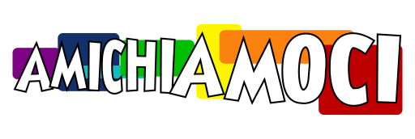

# Amichiamoci App
[](https://github.com/Amichiamoci/App/actions/workflows/docker-build.yml)


Questo è il codice sorgente dell'[App di Amichiamoci](https://app.amichiamoci.it "Vai alla App"), disponibile come repository ed anche come immagine docker.

```bash
docker pull amichiamoci/app:latest
```

## Testa localmente con VS Code
Clona la repo
```bash
git clone https://github.com/Amichiamoci/App && cd App
```

Crea, nella root del progetto, un file `.env.local` e riempilo con le variabili d'ambiente necessarie per far funzionare l'applicazione.

Dal menù di debug esegui `Debug PHP and container`, comando che costruirà il container e lo avvierà, collegando anche VS Code al debugger XDebug di PHP.